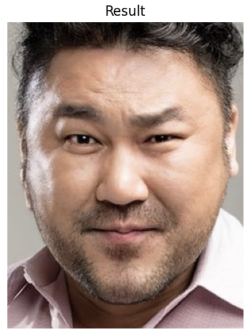

# V-Line Inpainting Editor with Stable Diffusion

This project uses **Stable Diffusion's inpainting capabilities** to apply a V-line effect to a person's jawline in images, providing a professional, sharp, and natural-looking facial contour. The implementation includes a **custom jawline mask generator** using `dlib` facial landmarks, and **Stable Diffusion API** is used to perform the inpainting based on this mask.

---

## Features
- **Custom Jawline Masking**: Detects facial landmarks and generates a custom mask around the jawline to enhance the V-line contour.
- **Stable Diffusion Inpainting API**: Applies inpainting with prompts for a refined and sharp jawline.
- **Seamless API Integration**: Uses Stability AI’s Stable Diffusion API for high-quality image output.

## Requirements

To run this project, you’ll need the following packages and files:
- Python 3.7 or later
- `dlib` (with `shape_predictor_68_face_landmarks.dat` for facial landmark detection)
- `opencv-python` and `opencv-python-headless`
- `requests`, `numpy`, `Pillow`, and `matplotlib`
- An API key from Stability AI to access the Stable Diffusion API

Install the required packages:
```bash
pip install dlib opencv-python opencv-python-headless requests numpy pillow matplotlib
```

You can download the `shape_predictor_68_face_landmarks.dat` file [here](http://dlib.net/files/shape_predictor_68_face_landmarks.dat.bz2) and unzip it in the project directory.

## Setup

1. **Clone this repository**:
   ```bash
   git clone https://github.com/yourusername/vline-inpainting-editor.git
   cd vline-inpainting-editor
   ```

2. **Add your Stability AI API key**:  
   Replace `"YOUR_API_KEY"` with your actual API key in the code file.

## Usage

To run the project, use the provided `apply_vline_sdxl` function to apply the V-line inpainting effect to an image.

### Example Code Usage

```python
from vline_inpaint import apply_vline_sdxl

api_key = "YOUR_API_KEY"
image_path = "path/to/your/image.jpg"
result_image = apply_vline_sdxl(image_path, api_key)
result_image.show()
```

### Class and Function Descriptions

#### `VLineInpaintEditorSDXL`
This class sets up the inpainting process and contains methods to generate the jawline mask and make requests to the Stable Diffusion API.

- **`__init__(self, api_key)`**: Initializes the API key and loads dlib’s facial landmark detector.
- **`image_to_base64(self, image)`**: Converts a PIL image to a base64 string for API compatibility.
- **`create_jaw_mask(self, image, landmarks, v_strength=0.5)`**: Generates a mask for the V-line by modifying the jawline points.
- **`process_image(self, image_path, prompt, seed)`**: Main method to process an image and apply inpainting.

#### `apply_vline_sdxl(image_path, api_key)`
This is the main function for applying the V-line effect. It initializes the editor, processes the image, and returns the result.

## Example Workflow

1. **Load an Image**: Pass the image path to the `apply_vline_sdxl` function.
2. **Generate Jawline Mask**: The script detects the face, generates a custom V-line mask, and sends it to the Stable Diffusion API.
3. **Run Inpainting**: The API uses the provided mask and prompt to refine the jawline with V-line characteristics.
4. **Display Results**: The processed image is displayed alongside the original and mask images for easy comparison.

## Troubleshooting

- **API Errors (400 Bad Request)**: Ensure the API key is correct and `Content-Type` headers are set to `multipart/form-data`. Ensure the mask format is PNG or JPEG.
- **dlib Installation**: Installing `dlib` can be tricky. Refer to the [official dlib installation guide](http://dlib.net/compile.html) if you encounter issues.
- **Missing Data Files**: Make sure `shape_predictor_68_face_landmarks.dat` is in the project directory.

## Examples

<p align="center">
    
    
    
</p>

- **Left**: Original Image  
- **Center**: Jaw Mask  
- **Right**: Final Inpainted Image  

## Contributing
We welcome contributions to enhance the functionality of this project! Please submit pull requests with detailed descriptions of your changes. Ensure all changes pass existing test cases and add new tests where applicable.

## License
This project is licensed under the MIT License. See the [LICENSE](LICENSE) file for more details.

## Contact
For any inquiries, please contact [your-email@example.com](mailto:your-email@example.com).

---

Enjoy creating sharp V-line jawlines with Stable Diffusion!
